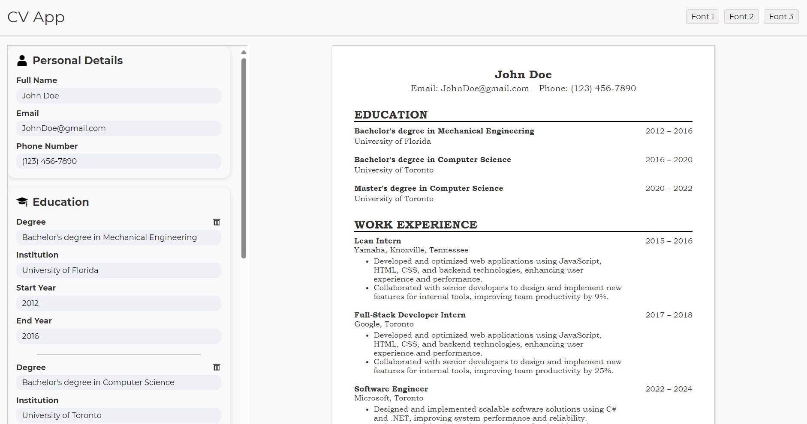

# CV APP

> - [Live Demo](https://mycvapplication.vercel.app/)

---

 

## About the project

Create a professional CV/résumé effortlessly with our web application! Built using React and powered by Vite, this application offers a seamless and efficient way to generate your CV in PDF format. With a user-friendly interface and real-time preview, you can see your changes instantly as you type. Whether you’re applying for a job or updating your professional profile, our app ensures your CV looks polished and professional.
  

## Features:

- Real-Time Preview: See your CV update live as you input your information.
- User-Friendly Interface: Intuitive forms and layout for a smooth user experience.
- Customizable Fonts: Choose from various font options to personalize your CV.
    

## Technologies used

 &emsp;  &emsp;  &emsp;  &emsp; <a href="https://vite.dev/guide/" target="_blank" rel="noreferrer"> 
  

## Contributing

Feedbacks, issues, and feature requests are welcome!
  
